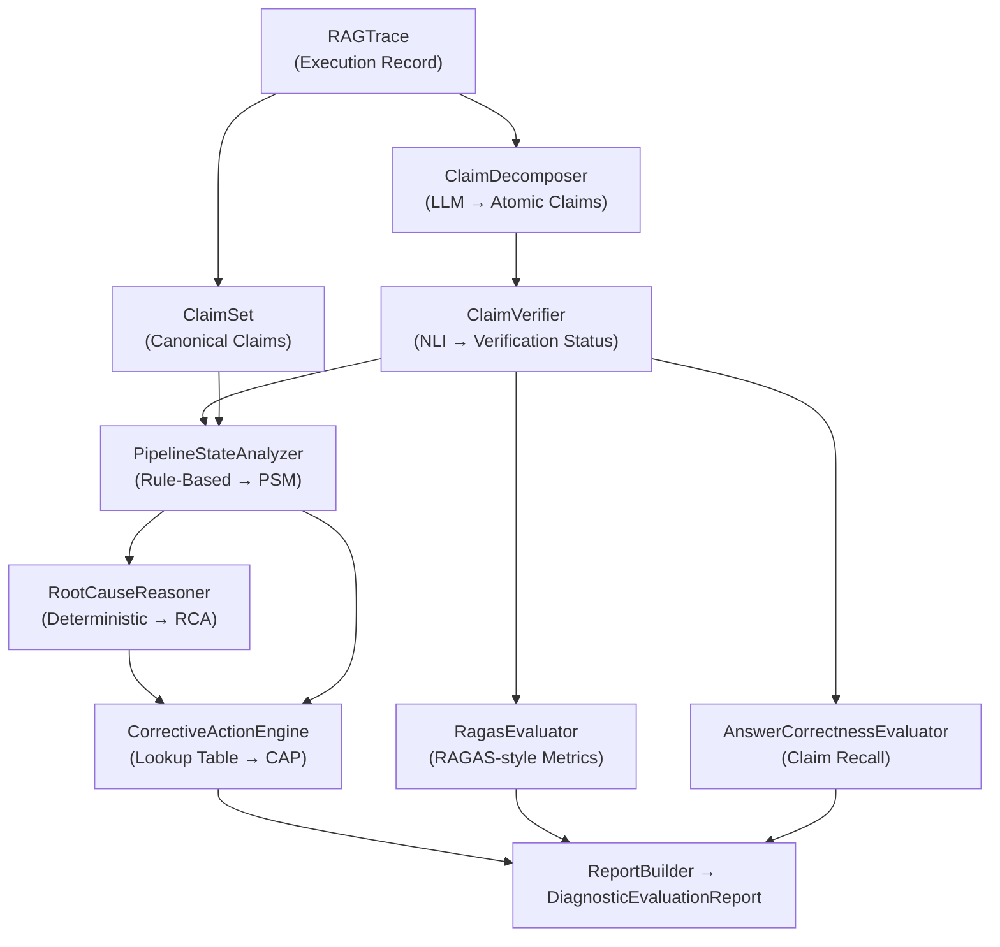

# X-RAG Framework — Critical Research Analysis
## Pre-Submission Weakness Audit

> [!CAUTION]
> This document is a strict, unsparing critique. Every issue listed is a real flaw that a peer reviewer, benchmarker, or adversarial reader will find. None of this is style preference — these are scientific and engineering defects.

---

## Framework Architecture Flow



---

## Module 1: `claim_decomposer.py` — The Foundation

### Critical Flaws

**🔴 FLAW 1: The LLM is used for decomposition but `complete()` not `chat()` is called**

```python
def _call_llm(self, prompt: str) -> str:
    response = self.llm.complete(prompt)  # ← WRONG FOR INSTRUCT MODELS
```

The Research Log itself (July 9, 2026) documents that calling `.complete()` on instruct-tuned models like Llama breaks instruction following. Yet the `ClaimDecomposer` uses `.complete()` not `.chat()`. This means the same hallucination bug the project fixed in the Generator is **still present in the Decomposer**. The model won't reliably return valid JSON — it will format as prose, add explanations, or fail the chat template. The multi-step JSON recovery exists *because of this bug*, not despite it.

**Fix:** Use `.chat(messages)` with a proper system + user message split, identical to what Generator uses.

---

**🔴 FLAW 2: The `sentence_id` field is useless — never populated by the LLM**

The prompt only asks the LLM for `claim_text` and `sentence_id`. But there is no instruction telling the LLM *what format* `sentence_id` should be (S001? UUID? index?). The decomposer code does:
```python
sentence_id = raw_claim.get("sentence_id", "")
unique_sentences.add(sentence_id)
```
If the LLM produces `sentence_id: "S1"` for every claim (common), all claims map to one sentence, making `total_sentences = 1` and `average_claims_per_sentence` nonsensical. If it produces UUIDs, there's 1 claim per sentence always. This metric is uncontrolled and unreliable.

**Fix:** Remove `sentence_id` from the LLM prompt entirely. Compute it deterministically from character offsets (`character_start`) on the Python side after decomposition.

---

**🔴 FLAW 3: `source_sentence` is deprecated but Claim still requires it**

```python
source_sentence="", # Removed from schema, kept in model for backward compatibility
```
`CandidateClaim` has `source_sentence` as a required field and the decomposer passes empty string. `Claim` (in `claims.py`) also has `source_sentence` as a required field. This means `ClaimFactory.create_claim()` is called with `source_sentence=""` always. The field is dead weight, but it's a required parameter in the dataclass — it will break if anyone adds a validation or type check. 

**Fix:** Remove `source_sentence` from both `CandidateClaim` and `Claim` dataclasses completely. This is a dead field that adds confusion.

---

**🟡 FLAW 4: Fuzzy matching with sliding window is O(n×m) and unreliable**

The `_fuzzy_match()` method uses a sliding window of `step = max(1, window_size // 10)` which is a 10% step size. This means it can miss the best match position if it falls between steps. For a 200-character claim in a 2000-character answer, the window slides in 20-character increments — the true best match can be skipped entirely.

**Fix:** Use Python's `difflib.SequenceMatcher.find_longest_match()` or regex-based approximate string matching (`rapidfuzz`) for reliable offset finding.

---

**🟡 FLAW 5: No deduplication of extracted claims**

If the LLM extracts `"Section 399 applies to..."` twice (common with repetitive answers), both are registered as separate `CandidateClaim` objects. Both are then verified separately, both count toward `total_claims`, inflating faithfulness scores artificially.

**Fix:** Hash `claim_text` (lowercase, stripped) and deduplicate before adding to `CandidateClaimSet`.

---

## Module 2: `claim_verifier.py` — The Core Evaluator

### Critical Flaws

**🔴 FLAW 6: NLI model is used as a zero-shot classifier — this is the wrong pipeline**

```python
self.nli_pipeline = pipeline(
    "text-classification",
    model=self.model_name,
    truncation=True
)
```
`deberta-v3-large-zeroshot-v2.0` is a **zero-shot classification** model. Using it with `"text-classification"` pipeline and `text`/`text_pair` format is *not* how this model is designed to work. Zero-shot models expect `{"sequences": ..., "candidate_labels": [...]}` via the `zero-shot-classification` pipeline. What the code does works accidentally for some models but the scores are not calibrated NLI entailment scores — they are misapplied zero-shot scores. This directly corrupts every entailment/contradiction/neutral score in the framework.

**Fix:** Either use a proper NLI model like `cross-encoder/nli-deberta-v3-large` with the `text-classification` pipeline, OR use the zero-shot model correctly with `zero-shot-classification` pipeline. These are fundamentally different.

---

**🔴 FLAW 7: Verification only uses *retrieved* chunks — not the full context the LLM saw**

```python
def verify_all(self, claim_set, trace_id, retrieved_chunks):
    for claim in claim_set.candidate_claims:
        res = self.verify_claim(claim, retrieved_chunks)
```

Claims are verified against the **retrieved chunks** only. But the LLM is given `retrieved_chunks + system prompt + question` as its full input. If the LLM generates a claim based on its **parametric memory** (which is exactly what hallucination is), that claim won't exist in any chunk — it will correctly score as UNSUPPORTED. However, if the LLM generates something from its system prompt or a malformed retrieved chunk, the current design has no way to detect this nuance. The framework conflates "not in retrieved chunks" with "hallucinated" when the real distinction is "not grounded in *any* evidence that was provided."

---

**🔴 FLAW 8: The threshold system is arbitrary and never validated**

```python
# configs/thresholds.py
ENTAILMENT_THRESHOLD = 0.7
CONTRADICTION_THRESHOLD = 0.7
PARTIAL_SUPPORT_THRESHOLD = 0.4
NEUTRAL_UNSUPPORTED_THRESHOLD = 0.8
```

These thresholds are **hardcoded magic numbers with no empirical basis**. There is no calibration experiment, no ablation study, and no dataset of labeled examples against which these values were optimized. For a research paper, this is a fatal weakness. A reviewer will immediately ask: "How did you determine 0.7 as the entailment threshold? Why not 0.5 or 0.8?"

**Fix:** Run a calibration experiment on at least 50–100 manually labeled (claim, evidence, status) triples. Report optimal threshold from precision-recall curve. Document the calibration in the paper.

---

**🟡 FLAW 9: Sentence splitter is regex-based and incorrect**

```python
sentences = re.split(r'(?<=[.!?])\s+(?=[A-Z])', text.strip())
```
This regex will break on:
- Abbreviations: `"Mr. Smith said..."` → splits at "Mr."
- Numbered lists: `"1. The law states..."` → won't split (no uppercase after space? It will actually not split here)
- Legal text with section numbers: `"399.(1) This section..."` → period not followed by space+uppercase correctly
- Decimal numbers: `"A fine of Rs.500 is..."` → splits incorrectly

For legal domain text (your primary test corpus), this is particularly bad. Every wrong sentence split produces wrong evidence sentences fed to NLI — corrupting the entire downstream verification.

**Fix:** Use `nltk.sent_tokenize()` or `spacy`'s sentence segmentation for robustness.

---

**🟡 FLAW 10: `max_pool_top3` aggregation strategy is provably broken**

```python
if self.aggregation_strategy == "max_pool_top3":
    return {
        "entailment": max(s.entailment_score for s in top_3),
        "contradiction": max(s.contradiction_score for s in top_3),
        "neutral": max(s.neutral_score for s in top_3),
    }
```
Taking the `max` of entailment, contradiction, AND neutral independently means the returned scores can sum to >1.0 (e.g., `entailment=0.7, contradiction=0.65, neutral=0.72` from different sentences). These are not valid probability distributions. Feeding these into `_determine_status_and_reason()` then applies threshold comparisons to non-probability values — the entire classification logic is mathematically invalid under this strategy.

The code even documents this: *"since all_scored_sentences is sorted by entailment_score descending, max-pooled entailment is always equal to top_3[0]'s entailment_score."* So `max_pool_top3` for entailment is identical to `top1`. The strategy produces broken distributions for contradiction/neutral but correct results for entailment — a partially-broken hybrid.

**Fix:** For `max_pool_top3`, take the argmax sentence by entailment score and use that sentence's full triplet (entailment, contradiction, neutral) which will sum to 1.0.

---

**🟡 FLAW 11: Verification is done sequentially — extremely slow**

```python
for claim in claim_set.candidate_claims:
    res = self.verify_claim(claim, retrieved_chunks)
```

Each call to `verify_claim` splits retrieved chunk text into sentences, then runs NLI once per sentence, per claim — **sequentially**. For 10 claims and 5 chunks each with 10 sentences, that's 500 NLI inference calls, one at a time. The NLI pipeline supports batch processing:

```python
# Batching available but unused
results = self.nli_pipeline(batch_of_pairs)
```

**Fix:** Collect all `(premise, hypothesis)` pairs across all claims and all sentences, run `self.nli_pipeline(all_pairs, batch_size=VERIFICATION_BATCH_SIZE)` in one call.

---

## Module 3: `pipeline_state_analyzer.py` — The Diagnostic Core

### Critical Flaws

**🔴 FLAW 12: CORPUS stage uses the wrong metric direction**

```python
min_distance = trace.execution_statistics.get("pre_rerank_min_dense_distance")
if min_distance > CORPUS_MAX_RELEVANT_DISTANCE:
    corpus_status = PipelineStatus.FAIL
```

ChromaDB with `hnsw:space = "cosine"` returns **cosine distance** (0 = identical, 1 = orthogonal, 2 = opposite). The condition `min_distance > 0.75` means "if the closest chunk is more than 75% dissimilar to the query, the corpus fails." This is correct in direction but `CORPUS_MAX_RELEVANT_DISTANCE = 0.75` is never empirically validated — it's an arbitrary constant. 

More critically: if the dense search returns distances but the **similarity_score** stored in `RetrievedChunk` is the **cross-encoder reranker score** (which is a continuous real number, not 0–1 cosine similarity), then the `max_score` comparison in the RETRIEVER stage:
```python
max_score = max((chunk.get("similarity_score", 0.0) for chunk in trace.retrieved_chunk_references), default=0.0)
```
...is comparing a **cross-encoder score** against `RETRIEVAL_SCORE_THRESHOLD = 0.5`, which is calibrated for cosine similarity. Cross-encoder scores can be negative and can exceed 1.0 — the comparison is unit-inconsistent.

---

**🔴 FLAW 13: CHUNKING stage almost always returns UNKNOWN**

```python
if boundary_claim_ids:
    chunking_status = PipelineStatus.FAIL
else:
    chunking_status = PipelineStatus.UNKNOWN  # ← default for everything else
    chunking_obs = "Deterministic chunk-boundary evidence is currently unobservable."
    chunking_conf = 1.0  # ← confidence=1.0 on UNKNOWN?!
```

The chunking stage can only detect failures via the chunk-adjacency heuristic. For all other cases it returns `UNKNOWN` with `confidence=1.0`. **A confidence of 1.0 on UNKNOWN is a contradiction** — it means "I am 100% certain I don't know." The PSM CHUNKING stage is effectively useless for the paper's claims about diagnosing chunking failures, unless the specific adjacency signal fires.

The condition also requires `PARTIALLY_SUPPORTED` claims — if all claims are either SUPPORTED or UNSUPPORTED (no partials), chunk boundary detection is completely blind regardless of whether chunks are actually split incorrectly.

---

**🟡 FLAW 14: GENERATOR stage logic is tautological with GROUNDING**

```python
# GENERATOR: FAIL if some_unsupported AND high score
# GROUNDING: FAIL if any contradicted

# But: if GENERATOR fails because claims are unsupported, 
# that exact same set of unsupported_verifications drives GROUNDING's check too.
```

The `supporting_claim_ids`, `supporting_chunk_ids`, and `supporting_verification_ids` passed to both GENERATOR and GROUNDING states are the **same lists** derived from `supported_verifications`. The two stages share almost all metadata. Downstream, the `RootCauseReasoner` has to pick between GENERATOR failure and GROUNDING failure as the primary cause — but neither has independent evidence.

---

**🟡 FLAW 15: No evaluation of the EMBEDDING stage**

The framework analyzes CORPUS, RETRIEVER, CHUNKING, GENERATOR, and GROUNDING. But there is no **EMBEDDING** stage. If the embedding model maps semantically different texts to similar vectors (a real failure mode), this will appear as a retrieval miss — and the framework will incorrectly diagnose it as `RETRIEVAL_MISS` or `MISSING_CORPUS`. The actual root cause (embedding quality) is invisible.

---

## Module 4: `root_cause_reasoner.py` — Causal Attribution

### Critical Flaws

**🔴 FLAW 16: Root cause selection is not actually causal — it's a confidence tie-breaker**

```python
primary_stage, final_primary_cause, primary_state = max(
    fail_stages,
    key=lambda item: (item[2].confidence, -traversal_order.index(item[0]))
)
```

The primary cause is selected as the **highest-confidence failure**, with causal order as a tiebreaker. This means if GROUNDING fails with `confidence=0.95` and CORPUS fails with `confidence=0.85`, GROUNDING is selected as primary — even though CORPUS failure logically *causes* GROUNDING failure. The reasoner does not actually reason causally; it finds the most statistically confident failure and calls it "primary."

A legitimate causal reasoner should traverse stages in order and stop at the earliest failure that explains the downstream ones (propagation logic). The current design can select a downstream symptom as the "primary cause" when an upstream root cause exists.

---

**🟡 FLAW 17: `MULTI_HOP_REASONING_FAILURE` is defined but never set**

```python
class FailureType(str, Enum):
    ...
    MULTI_HOP_REASONING_FAILURE = "MULTI_HOP_REASONING_FAILURE"
```

This `FailureType` exists in the enum and the `STAGE_TO_FAILURE_MAP` doesn't map any stage to it. No path in `RootCauseReasoner.analyze()` can ever produce `MULTI_HOP_REASONING_FAILURE` as a primary or secondary cause. It's dead code that will confuse a reader. Either implement it or remove it.

---

**🟡 FLAW 18: The reasoning chain is a log, not actual reasoning**

```python
reasoning_chain.append(f"Failure Observed at {stage.value}: {failure_type.value}. Observation: {state.observation}")
reasoning_chain.append(f"Primary Cause Identified at {stage.value}: ...")
```

The `reasoning_chain` is simply a log of what stages failed, copied from observation strings. It contains no actual logical inference. A paper claiming "the system performs root cause reasoning" needs the reasoning chain to demonstrate causal logic like: *"GROUNDING failed because RETRIEVER failed first: the retrieved chunks did not contain relevant evidence, forcing the LLM to hallucinate."* What exists is closer to a debug log than a reasoning trace.

---

## Module 5: `corrective_action_engine.py` — Recommendations

### Critical Flaws

**🔴 FLAW 19: The corrective action lookup table is fully static — no adaptation**

```python
self.lookup_table = {
    FailureType.RETRIEVAL_MISS: [
        {"title": "Increase Retrieval Top-K", ...},
        {"title": "Implement Hybrid Search (Dense + Sparse)", ...},
        ...
    ]
}
```

The CAE is a **static dictionary**. Given `RETRIEVAL_MISS`, it always returns the exact same three recommendations, regardless of whether:
- The system already has hybrid search
- `RETRIEVAL_TOP_K` is already 20
- The question type is exact-match vs. semantic

This means the "corrective actions" are not actually derived from the observed trace — they are boilerplate prescriptions. For a research paper, recommending "Implement Hybrid Search" to a system that already has hybrid search is both factually wrong and embarrassing.

**Fix:** Add context-awareness: check `trace.configuration_snapshot` to see what features are already enabled and exclude recommendations that apply to existing capabilities.

---

**🟡 FLAW 20: Template interpolation silently substitutes 'N/A' for missing values**

```python
class _SafeDict(dict):
    def __missing__(self, key):
        return "N/A"
```

If a format key is missing (e.g., `{pre_rerank_min_dense_distance}` when no dense score was captured), the output reads: *"closest of N/A candidates had cosine distance N/A."* This is user-hostile and a research paper quality issue.

---

## Module 6: `ragas_metrics.py` — Evaluation Metrics

### Critical Flaws

**🔴 FLAW 21: `compute_faithfulness` is NOT the RAGAS definition**

RAGAS faithfulness is:
```
faithfulness = |supported claims| / |total claims|
```
Your implementation:
```python
weighted_supported = verification.supported_claims + 0.5 * verification.partially_supported_claims
return round(weighted_supported / verification.total_claims, 4)
```

This uses a **half-credit** scheme for partially supported claims, which RAGAS does not. The paper cannot claim RAGAS-equivalent faithfulness without documenting this deviation. This is a metric definition inconsistency that will be flagged in peer review.

---

**🔴 FLAW 22: `compute_context_recall` concatenates all chunks into a single string**

```python
combined_context = " ".join(chunk.chunk_text for chunk in retrieved_chunks)
supported = sum(
    1 for sentence in reference_sentences
    if self.claim_verifier.run_nli(premise=combined_context, hypothesis=sentence)[...] >= threshold
)
```

Concatenating all chunks as the NLI premise violates the DeBERTa model's 512-token limit (`truncation=True` silently truncates the concatenated premise). For 5 chunks of 512 tokens each, the last 4 chunks are completely invisible to the NLI model. Context recall is then computed only against the first ~512 tokens of context, which is chunk 1 only. **This silently produces wrong results for any multi-chunk recall computation.**

**Fix:** Score each reference sentence against each chunk separately (keeping them under 512 tokens), then aggregate: a sentence is "supported" if *any* chunk entails it.

---

**🔴 FLAW 23: `compute_answer_relevancy` generates synthetic questions without quality control**

```python
generated_questions = [q.strip("-* ").strip() for q in response_text.split("\n") if q.strip()]
```

If the LLM returns fewer than `ANSWER_RELEVANCY_NUM_QUESTIONS` questions (or returns prose instead of one-per-line), the similarity is computed over however many were parsed — possibly 0 (returns `None`) or 1. This means the metric can have vastly different confidence depending on LLM output quality, yet all results are reported as a clean 0–1 score with no confidence interval.

---

**🟡 FLAW 24: `_cosine_similarity` is a manual pure-Python implementation**

```python
def _cosine_similarity(a, b):
    dot = sum(x * y for x, y in zip(a, b))
    norm_a = sum(x * x for x in a) ** 0.5
    ...
```

For 384-dimensional vectors, this loop runs 768 multiplications per call. `numpy.dot()` with BLAS is 50–100x faster. This is called repeatedly during answer relevancy metric computation. Not a correctness issue, but a performance red flag in research benchmarking.

---

## Module 7: `claims.py` — Data Model Issues

### Critical Flaws

**🟡 FLAW 25: `ClaimType` and `VerificationComplexity` are defined but never populated**

```python
class ClaimType(str, Enum):
    ENTITY = "ENTITY"
    ATTRIBUTE = "ATTRIBUTE"
    ...

class VerificationComplexity(str, Enum):
    VCL1 = "VCL1"
    ...
```

No module in the codebase assigns `claim_type` or `verification_complexity` to any claim. These fields are always `None`. The paper cannot claim claim-type-aware evaluation without populating these.

---

**🟡 FLAW 26: `claim_hash` is defined but never computed**

```python
claim_hash: Optional[str] = None
```

The Research Log explicitly mentions hashing as a deduplication mechanism. `ClaimFactory.create_claim()` never sets `claim_hash`. The deduplication it was designed to enable is completely missing.

---

**🟡 FLAW 27: `ClaimSet.get_claim()` is O(n) linear scan**

```python
def get_claim(self, claim_id: str) -> Optional[Claim]:
    for claim in self.claims:
        if claim.claim_id == claim_id:
            return claim
```

For 20+ claims per trace, this is fine. But if the framework is extended to batch-evaluate across 100s of traces and 1000s of claims, this becomes a bottleneck. A `Dict[str, Claim]` index should be maintained alongside the list.

---

## Module 8: `report_builder.py` — Report Assembly

### Critical Flaws

**🔴 FLAW 28: `overall_health_score` = `grounding_score` — single-metric oversimplification**

```python
overall_health = metrics.grounding_score if verification else 0.0
```

The overall health score is **purely the grounding score** (fraction of supported claims). This ignores:
- Retrieval quality (were the right chunks found?)
- Context precision
- RAGAS metrics
- Answer relevancy

A system that retrieves completely wrong chunks but the LLM answers correctly from parametric knowledge would score a **high grounding score** (all claims verified as unsupported, so `weighted_supported = 0`, score = 0) — but a low health score. A system that retrieves correct chunks but the LLM ignores them would also score 0 supported. The single-metric health score cannot distinguish these cases.

---

**🟡 FLAW 29: `overall_assessment.major_strength` is hardcoded**

```python
if overall_health > 0.8:
    major_strength = "Strong evidence grounding."
else:
    major_strength = "N/A"  # ← always N/A unless health > 0.8
```

For any pipeline with less than 80% grounding, the report says `major_strength = "N/A"`. This is not an analysis — it's a placeholder that was never replaced.

---

## Module 9: Architecture-Level Issues

### Critical Flaws

**🔴 FLAW 30: No ground-truth benchmark dataset — the framework cannot be validated**

The framework produces `PipelineStatus.PASS/FAIL` decisions and `FailureType` classifications. But there is **no gold-labeled test set** against which to measure:
- What fraction of CORPUS FAIL diagnoses are correct?
- What is the false positive rate for GROUNDING FAIL?
- Does the primary cause diagnosis match human-labeled causes?

Without validation against human annotations or synthetic failure injection tests, the framework's diagnostic accuracy is unproven. This is the single biggest weakness for a research paper.

**Fix:** Create at least 30–50 manually crafted traces with known injected failures (e.g., deliberately remove a relevant chunk → should trigger RETRIEVAL_MISS) and measure framework detection accuracy.

---

**🔴 FLAW 31: Two parallel claim models (`CandidateClaim` vs `Claim`) with redundant conversion**

In `query.py` and `runner.py`, every `CandidateClaim` is converted to a `Claim` via `ClaimFactory`:
```python
for c in candidate_claim_set.candidate_claims:
    claim = claim_factory.create_claim(
        claim_text=c.claim_text,
        source_sentence=c.source_sentence,  # ← always ""
        ...
    )
    claim_set.add_claim(claim)
```

The `ClaimSet` is passed to `PipelineStateAnalyzer.analyze()` but is **never used** inside that function — it takes the `claim_set` parameter but only uses `verification.results`. The entire `CandidateClaim → Claim → ClaimSet` conversion pipeline produces a `ClaimSet` that does nothing. The `ClaimSet` artifact is saved to disk but contributes zero logic to the analysis.

This is dead code masquerading as a pipeline stage.

---

**🔴 FLAW 32: Framework is not reproducible — no random seed control, no config locking**

The framework uses LLM calls (claim decomposition, RAGAS metric judgements) that are non-deterministic (`temperature=0.1`, not 0.0). Running the same trace twice produces different decompositions, different claim counts, potentially different verification outcomes, and different RAGAS scores. The paper cannot present results as reproducible benchmarks.

**Fix:** Set `temperature=0.0` for all framework calls (not just recommendation — required for reproducibility). Implement a global `random_seed` config. Log exact model versions with hashes.

---

**🟡 FLAW 33: No unit tests for the diagnostic modules**

The `tests/` and `tests_eval/` directories exist but contain eval adapter tests, not unit tests for:
- `ClaimDecomposer.decompose()` — does it correctly extract claims?
- `ClaimVerifier.verify_claim()` — does SUPPORTED/UNSUPPORTED map correctly?
- `PipelineStateAnalyzer.analyze()` — do PASS/FAIL rules trigger correctly?
- `RootCauseReasoner.analyze()` — does primary cause selection work?

Without tests, regressions in any of these modules are invisible. A research artifact without test coverage is not production-grade.

---

**🟡 FLAW 34: RAGAS metrics and claim-level verification use the same NLI model for different tasks**

The `ClaimVerifier` (NLI model for entailment) and `compute_context_recall` (also NLI entailment) use `deberta-v3-large-zeroshot-v2.0`. The `compute_answer_relevancy` uses the embedding model. The `compute_context_precision` and `context_relevancy` use the Generator's LLM as a judge. This means RAGAS metrics depend on **three different model subsystems** — the results are not comparable across model version changes. There is no isolation between the framework's internal verification and its external metric computation.

---

## Priority Fix Roadmap for Research Paper Submission

| Severity | Flaw # | Module | Issue | Fix Cost |
|---|---|---|---|---|
| 🔴 CRITICAL | 6 | ClaimVerifier | Wrong NLI pipeline type | Low — 1 line change |
| 🔴 CRITICAL | 1 | ClaimDecomposer | `.complete()` vs `.chat()` | Low — same fix as Generator |
| 🔴 CRITICAL | 30 | Architecture | No ground-truth validation dataset | High — requires annotation |
| 🔴 CRITICAL | 22 | RagasMetrics | Context recall silently truncated at 512 tokens | Medium — per-chunk scoring |
| 🔴 CRITICAL | 32 | Architecture | Non-reproducible (temperature > 0, no seed) | Low — config change |
| 🔴 CRITICAL | 16 | RootCauseReasoner | Confidence-based selection is not causal | Medium — re-design |
| 🔴 CRITICAL | 12 | PSA | Score units inconsistent (cross-encoder vs cosine) | Medium |
| 🔴 CRITICAL | 19 | CAE | Recommendations ignore existing capabilities | Medium |
| 🔴 CRITICAL | 21 | RagasMetrics | Faithfulness ≠ RAGAS definition | Low — document or fix |
| 🔴 CRITICAL | 31 | Architecture | ClaimSet conversion is dead code | Low — remove |
| 🟡 IMPORTANT | 8 | ClaimVerifier | Thresholds have no empirical basis | High — calibration study |
| 🟡 IMPORTANT | 9 | ClaimVerifier | Regex sentence splitter breaks on legal text | Low — use nltk |
| 🟡 IMPORTANT | 10 | ClaimVerifier | max_pool_top3 produces invalid probability sums | Low — fix aggregation |
| 🟡 IMPORTANT | 13 | PSA | CHUNKING stage almost always UNKNOWN | Medium — new signals |
| 🟡 IMPORTANT | 17 | RootCauseReasoner | MULTI_HOP_REASONING_FAILURE is dead code | Low — remove or implement |
| 🟡 IMPORTANT | 25 | Claims | ClaimType never populated | Medium — add classifier |
| 🟡 IMPORTANT | 28 | ReportBuilder | Health score = single metric | Medium — composite score |
| 🟡 IMPORTANT | 33 | Tests | No unit tests for diagnostic modules | High — write tests |
| 🟢 MINOR | 2 | ClaimDecomposer | sentence_id uncontrolled | Low |
| 🟢 MINOR | 3 | ClaimDecomposer | source_sentence is dead field | Low — remove |
| 🟢 MINOR | 5 | ClaimDecomposer | No claim deduplication | Low |
| 🟢 MINOR | 11 | ClaimVerifier | Sequential NLI — no batching | Medium — performance |
| 🟢 MINOR | 24 | RagasMetrics | Pure Python cosine — use numpy | Low |
| 🟢 MINOR | 26 | Claims | claim_hash never computed | Low |
| 🟢 MINOR | 29 | ReportBuilder | major_strength hardcoded | Low |
